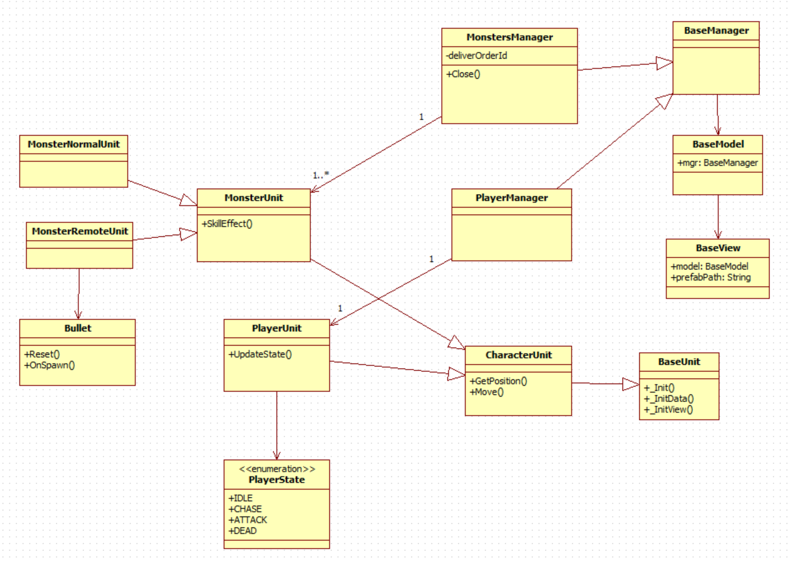

# 作业文档
## Base类
**BaseClass:** 提供类的初始化方法以及继承实现

**BaseManager:** Manager类的基类，生成model类，控制层

**BaseModel:** Model类的基类，生成view类，处理数据

**BaseView:** View类的基类，处理与更新视图

**CharacterManager:** 角色控制层基类，继承自`BaseManager`

**CharacterModel:** 角色模型层基类，继承自`BaseModel`

**CharacterView:** 角色视图层基类，继承自`BaseView`

**类图**

## Lua与Csharp交互类

| Csharp   | Lua |作用      |
|--------|------|----------|
| `LuaUpdateBehaviour`   |  `UpdateManager`  | 桥接Update方法   |
| `AnimationEventBridge`   | `GetAnimationScript()` | 桥接动画事件回调 |

## 游戏主逻辑
### 游戏入口
**Game:** 游戏开始入口，初始化类

**ManagerSystem:** 管理所有Manager类，依次加载不同控制类

**时序图**

## 主角
### 主角基础类
**PlayerManager:** 继承自`CharacterManager`

**PlayerModel:** 继承自`CharacterModel`,重写_InitData

**PlayerView:** 继承自`CharacterView`,重写_InitView,绑定角色Object

### 技能
**SkillManager:** 解析`SkillConfig`,根据优先级以及CD选择技能，更新技能CD

**SkillConfig:** 提供技能配置功能，配置优先级、伤害、CD等

### 状态机
**StateMachine:** 状态机，提供状态切换以及状态添加方法

**State：** 状态基类，提供OnEnter、Update、OnExit方法等

**PlayerIdleState:** 继承`State`，角色静止状态

**PlayerAttackState:** 继承`State`，角色攻击状态

**PlayerChaseState:** 继承`State`，角色追逐状态

**PlayerDeadState:** 继承`State`，角色死亡状态，绑定死亡动画回调事件，通知主角控制层

**主角状态图**

## 怪物
**MonsterManager:** 继承自`CharacterManager`

**MonsterModel:** 继承自`CharacterModel`,重写_InitData

**MonsterView:** 继承自`CharacterView`,重写_InitView,绑定怪物Object

### 普通怪
**MonsterNormalManager:** 继承自`MonsterManager`

**MonsterNormalModel:** 继承自`MonsterModel`

**MonsterNormalView:** 继承自`MonsterView`

### 远程怪
**MonsterRemoteManager:** 继承自`MonsterManager`

**MonsterRemoteModel:** 继承自`MonsterModel`,重写攻击方法，提供远程发射功能

**MonsterRemoteView:** 继承自`MonsterView`

### 状态机
**MonsterIdleState:** 继承`State`，怪物静止状态

**MonsterAttackState:** 继承`State`，怪物攻击状态

**MonsterChaseState:** 继承`State`，怪物追逐状态

**MonsterDeadState:** 继承`State`，怪物死亡状态

**怪物状态图**

## UI
**UIManager:** 通过栈的数据结构管理多个UI的显示与隐藏

**MainInterface:** 主界面，显示HP、技能CD等

**GameWinInterface:** 游戏胜利界面

**GameLoseInterface:** 游戏失败界面

## 关卡
**LevelsManager:** 解析`LevelsConfig`,控制多个关卡之间的生成与切换

**LevelsConfig:** 提供关卡配置功能，配置关卡数、怪物种类、批次等

**LevelManager:** 负责与`LevelsManager`的交互功能，提供关卡内的批次怪物生成接口

**LevelModel:** 负责怪物不同种类与批次数据处理的模型层

## 事件
**EventManager:** 提供事件的订阅与分发功能

## 对象池
**ObjectPoolManager:** 

**Pool:**

## Camera
**CameraManager:** 初始化Cinemachine，设置follow和lookAt属性

## BackGround
**BackGroundManager:** 实现背景无限滚动
